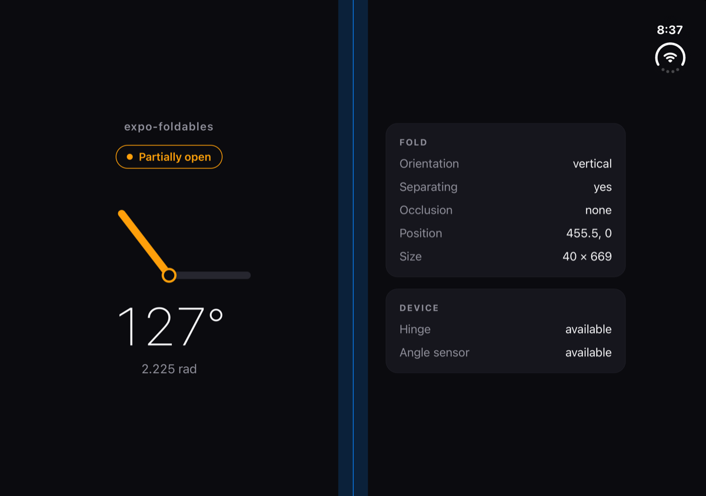

# expo-foldables

Hinge posture, angle, and fold geometry for foldable devices: iPhone Duo and Android foldables.

- **Posture and fold geometry** for layout: know when the device is half open and where the fold crosses your window.
- **Continuous hinge angle** in degrees for interactive effects.
- **React hooks** built on a plain imperative API, so you can use either.

<p align="center">
  
</p>

## Contents

- [Requirements](#requirements)
- [Installation](#installation)
- [Usage](#usage)
- [API](#api)
- [How it works](#how-it-works)
- [Troubleshooting](#troubleshooting)
- [Contributing](#contributing)

## Requirements

| Platform | Requirement                                                                                                                                 |
| -------- | ------------------------------------------------------------------------------------------------------------------------------------------- |
| iOS      | **Xcode 27.1+** (iOS 27.1 SDK) and the [UIScene life cycle](#ios-app-crashes-at-launch-uiscene-life-cycle-is-required). Data on iPhone Duo. |
| Android  | Any foldable. Posture and fold geometry come from Jetpack WindowManager. The angle needs a hinge sensor (Android 11+).                      |
| Web      | Supported as a no-op: behaves like a device without a hinge.                                                                                |

Expo Go is not supported. Use a [development build](https://docs.expo.dev/develop/development-builds/introduction/).

> [!WARNING]
> The hinge APIs ship only in the iOS 27.1 SDK. Older Xcode versions fail to compile the module with missing `UIHinge`
> symbols. `pod install` prints a warning when it detects an older Xcode.

## Installation

```sh
npx expo install expo-foldables
```

Then rebuild your app:

```sh
npx expo run:ios
npx expo run:android
```

## Usage

### Adapt the layout with `useHinge`

`useHinge()` returns the current state and re-renders when the posture or fold changes. It returns `undefined` on
devices without a hinge, so one check covers every phone.

```tsx
import { useHinge } from 'expo-foldables';

function Reader() {
  const hinge = useHinge();
  const fold = hinge?.fold;

  if (fold?.isSeparating && fold.orientation === 'vertical') {
    // Book posture: lay out two pages and keep content off the fold.
    return (
      <View style={{ flexDirection: 'row' }}>
        <Page style={{ width: fold.bounds.x }} />
        <View style={{ width: fold.bounds.width }} />
        <Page style={{ flex: 1 }} />
      </View>
    );
  }

  if (fold?.isSeparating && fold.orientation === 'horizontal') {
    // Tabletop posture: content on top, controls on the bottom half.
    return <VideoWithControlsBelow foldY={fold.bounds.y} />;
  }

  return <SinglePage />;
}
```

### Drive effects with `useHingeAngle`

`useHingeAngle()` returns the angle in degrees: `0` is folded shut and `180` is flat. Use `minDeltaDegrees` to skip
tiny changes and limit re-renders.

```tsx
import { degreesToRadians, useHingeAngle } from 'expo-foldables';

function Lid() {
  const angleDegrees = useHingeAngle({ minDeltaDegrees: 1 });
  if (angleDegrees === undefined) {
    return null; // no hinge, or no reading yet
  }
  return (
    <Text>{`${Math.round(angleDegrees)}° (${degreesToRadians(angleDegrees).toFixed(2)} rad)`}</Text>
  );
}
```

> [!TIP]
> Make layout decisions from the posture and fold, not from the angle. Apple gives the same guidance for iPhone Duo:
> the angle is for live effects, such as a control that responds to how far the device is folded.

### Use the imperative API

Outside React, or when you need full control over subscriptions:

```ts
import { Hinge } from 'expo-foldables';

const state = Hinge.getState(); // HingeState | undefined

const subscription = Hinge.addOnStateChangeListener((next) => {
  console.log(next?.posture, next?.fold);
});

// Later:
subscription.remove();
```

Check `Hinge.isAngleAvailable` before subscribing to the angle. `addOnAngleChangeListener` throws when the device can't
report it:

```ts
if (Hinge.isAngleAvailable) {
  const angleSubscription = Hinge.addOnAngleChangeListener(
    (angleDegrees) => console.log(angleDegrees),
    { minDeltaDegrees: 0.5 }
  );
}
```

## API

### `Hinge`

| Member                                         | Description                                                                          |
| ---------------------------------------------- | ------------------------------------------------------------------------------------ |
| `isAvailable: boolean`                         | Whether the device has a hinge. Can turn `true` shortly after launch, see below.     |
| `isAngleAvailable: boolean`                    | Whether the continuous angle is reported.                                            |
| `getState(): HingeState \| undefined`          | The current state, or `undefined` without a hinge.                                   |
| `addOnStateChangeListener(listener)`           | Calls `listener` when the posture or fold changes. Returns a `HingeSubscription`.    |
| `addOnAngleChangeListener(listener, options?)` | Calls `listener` with the angle in degrees. Throws if `isAngleAvailable` is `false`. |

### Hooks

| Hook                      | Returns                                                                                     |
| ------------------------- | ------------------------------------------------------------------------------------------- |
| `useHinge()`              | `HingeState \| undefined`                                                                   |
| `useHingeAngle(options?)` | Angle in degrees, or `undefined` before the first reading and on devices without the angle. |

Both hooks clean up on unmount. `useHingeAngle` subscribes automatically once the hinge becomes available.

### Helpers

| Function                    | Description                                                                                     |
| --------------------------- | ----------------------------------------------------------------------------------------------- |
| `degreesToRadians(degrees)` | Converts degrees to radians. iOS reports radians natively, this library always reports degrees. |
| `radiansToDegrees(radians)` | Converts radians to degrees.                                                                    |

### Types

```ts
interface HingeState {
  /** Mirrors Apple's UIHinge.Status. */
  posture: 'closed' | 'partially-open' | 'fully-open' | 'unknown';
  /** Where the fold crosses the window. Undefined when it doesn't, e.g. on the cover display. */
  fold?: Fold;
}

interface Fold {
  /** Window coordinates, in points (the unit React Native uses for layout). */
  bounds: { x: number; y: number; width: number; height: number };
  /** 'vertical' splits the window into left and right halves. */
  orientation: 'horizontal' | 'vertical';
  /** True when the fold visually splits the window. Keep content off it. */
  isSeparating: boolean;
  /** 'full' when the fold area can't display content, as with a physical gap between two screens. */
  occlusion: 'none' | 'full';
}

interface AngleChangeListenerOptions {
  /** Smallest change in degrees that triggers an update. Defaults to 0. */
  minDeltaDegrees?: number;
}
```

## How it works

| Data    | iOS (iPhone Duo)                              | Android                                                                     |
| ------- | --------------------------------------------- | --------------------------------------------------------------------------- |
| Posture | `UIHingeInteraction` → `UIHinge.status`       | `FoldingFeature.state`, or the hinge sensor when no fold crosses the window |
| Angle   | `UIHinge.angle`, converted from radians       | `Sensor.TYPE_HINGE_ANGLE`                                                   |
| Fold    | The `.division` reserved region of the window | `FoldingFeature` bounds, converted from pixels to points                    |

Platform details worth knowing:

- **iOS fold bounds include margins.** On iPhone Duo the division region is 40 points wide, centered on the fold line.
  It stays reported when the device is flat, with `isSeparating: false`.
- **Android posture without a fold.** When no fold crosses the window, for example on the cover display, the posture
  comes from the hinge sensor: 10° or less is `closed`, 170° or more is `fully-open`.
- **Android without a hinge sensor.** `isAvailable` turns `true` only once the system first reports a fold, and
  `isAngleAvailable` stays `false`.

## Troubleshooting

### iOS: app crashes at launch, "UIScene life cycle is required"

```
Application failed to launch: UIScene life cycle is required for apps built with this SDK.
```

This affects every app built with the iOS 27.1 SDK, not only apps using this module. Expo 57 includes
`ExpoAppSceneDelegate` for it, but the SDK 57 app template doesn't use it yet. Copy the config plugin from
[`example/plugins/withSceneLifecycle.js`](example/plugins/withSceneLifecycle.js) into your project and register it:

```json
{
  "expo": {
    "plugins": ["./plugins/withSceneLifecycle"]
  }
}
```

Then run `npx expo prebuild --clean`.

### iOS: build fails with missing `UIHinge` symbols

Errors like `cannot find 'UIHingeInteraction' in scope` mean you're building with Xcode 27.0 or older. Install Xcode 27.1+. If it isn't your default Xcode, point the build at it:

```sh
DEVELOPER_DIR=/path/to/Xcode.app/Contents/Developer npx expo run:ios
```

### `isAvailable` is `false` right after launch

Platforms report the hinge asynchronously. On iPhone Duo the first report arrives shortly after the window appears.
Use `useHinge()` or `addOnStateChangeListener` rather than reading `isAvailable` once at startup.

### `useHingeAngle()` always returns `undefined` on Android

The device has no hinge angle sensor. Posture and fold geometry still work through `useHinge()`.

## Contributing

```sh
bun install
bun run lint
bun run typecheck
bun run test       # Vitest
bun run build
```

### Run the example on iPhone Duo

Needs Xcode 27.1+ and the iOS 27.1 simulator runtime.

```sh
xcodebuild -downloadPlatform iOS
xcrun simctl create "iPhone Duo" com.apple.CoreSimulator.SimDeviceType.iPhone-Duo com.apple.CoreSimulator.SimRuntime.iOS-27-1
cd example
npx expo run:ios --device "iPhone Duo"
```

Open **DeviceHub** (in `Xcode.app/Contents/Applications`) to fold, unfold, and rotate the simulated device.

### Run the example on an Android foldable

In Android Studio's Device Manager, create a **Pixel 9 Pro Fold** virtual device with an API 36 image, start it, then:

```sh
cd example
npx expo run:android
```

Use the emulator's extended controls to change the fold posture.

## License

MIT
